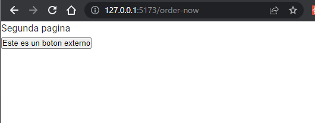

# Pantilla Custom Component para renderJSON

### **Paso 1**

Deberas instalar las dependencias conv`npm i`

### **Paso 2**

Para cear el componente puedes hacerlo dentro de `/src/components` example:

```tsx
import React from "react";

export const ButtonMsg = () => {
  const hello = () => {
    alert("Hola mundo desde remote app");
  };
  return <button onClick={() => hello()}>Este es un boton externo</button>;
};
```

### **Paso 3**

Luego deberas suscribir este componente en el archivo `ExportComponent.tsx` asi:

```tsx
import { ButtonMsg } from "./components/ButtonMsg";
type props = {
  name: string;
  props: any;
};
export default function GetComponent({ name, props }: props) {
  switch (name) {
    case "ButtonMsg": // El nombre de como lo llamaras en RenderJSON
      return <ButtonMsg />;
    default:
      <h1>No haz seleccionado un componente</h1>;
  }
}
```

Por el momento deberas crear todos los componentes customizados en este proyecto

### **Paso 4**

Deberas correr los siguientes comando :
`npm run build`
`npm run preview`

### **Paso 5**

Ahora en `RenderJSON` lo llamaras llamaras así:

```json
{
  "target": "Custom", // Aqui se declara que es un componente custom
  "name": "button-remote",
  "nameApp": "ButtonMsg" // EL nombre del custom component
}
```

Resultado

